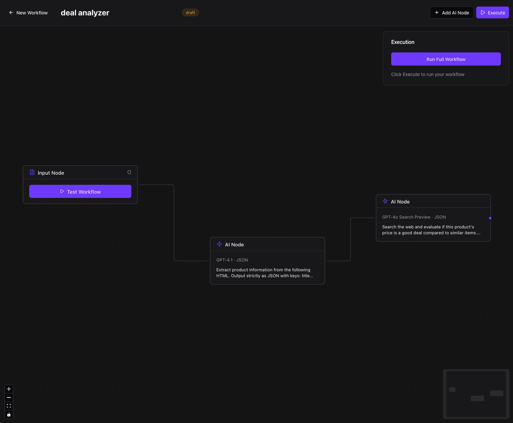

# inferpipe

## ⚠️ Important Warning

**inferpipe is currently in alpha stage and is a work in progress.** It is not ready for production use. Features may change, and there may be bugs or incomplete functionality. Use at your own risk for development and testing purposes only.

## Overview

inferpipe is a visual AI workflow builder that enables you to build, test, and deploy AI pipelines without complex development or infrastructure setup. Add intelligent automation to any application through an intuitive drag-and-drop interface.

Our goal is to democratize AI workflow creation, allowing teams to rapidly prototype and iterate on AI-powered features using structured outputs, multi-step processing, and integration with various AI models.

## Key Goals

- Provide a visual, no-code interface for designing complex AI workflows
- Support structured JSON schema outputs for reliable data extraction
- Enable testing and debugging of AI pipelines in real-time
- Facilitate seamless deployment and integration via SDK and APIs
- Support a range of AI models with specialized capabilities like web search and audio processing

## Supported Models

inferpipe supports a variety of OpenAI models, categorized as follows:

### Reasoning Models
- **GPT-4.1**: Latest flagship reasoning model
- **GPT-4.1 Mini**: Lightweight reasoning with lower cost

### General Purpose Models
- **GPT-4o**: Balanced quality for multimodal tasks
- **GPT-4o Mini** (default): Fast, cost-effective general model
- **GPT-4 Turbo**: High-quality GPT-4 generation
- **GPT-3.5 Turbo**: Legacy fast model

### Web Search Enabled Models
- **GPT-4o Search Preview**: Web-enabled GPT-4o preview
- **GPT-4o Mini Search Preview**: Web-enabled GPT-4o mini preview

### Speech & Audio Models
- **GPT-4o Transcribe**: High quality speech-to-text
- **GPT-4o Mini Transcribe**: Fast speech-to-text
- **GPT-4o Mini TTS**: Text-to-speech generation

These models support various capabilities including text generation, web search integration, and audio processing.

## Workflow Builder Capabilities

The core of inferpipe is the visual Workflow Builder, which allows you to:

### Visual Pipeline Design
- Drag-and-drop interface to create AI workflows
- Connect nodes for multi-step processing (e.g., input → extraction → search → output)
- Pre-built nodes for common operations like data extraction, content generation, and analysis



### Custom JSON Schema
- Define structured outputs using a UI schema editor
- Support for data types, nested objects, arrays, and validation
- Automatic parse retry to ensure schema compliance

### Testing & Iteration
- Built-in prompt testing with real-time results
- Step-by-step debugging and execution tracing
- A/B testing for prompts and models
- Performance monitoring and cost metrics

### Node Inspector & Output Overview
- Inspect node configurations and intermediate results
- View step-by-step output for each workflow stage
- Structured data visualization for easy validation

### Example Use Cases
- **SaaS Applications**: Customer support automation, content generation for marketing
- **E-commerce**: Product description generation, review analysis, personalized campaigns
- **Data Processing**: Extraction from documents, sentiment analysis, translation

## Getting Started

### 1. Visual Builder
- Access the builder at `/app` after signing in
- Start with templates for common workflows or build from scratch
- Test inputs and iterate on node configurations

### 2. SDK Integration
For programmatic access, use the inferpipe SDK:

```bash
npm install @inferpipe/sdk
```

Basic setup:

```typescript
import { InferPipe } from '@inferpipe/sdk';

const inferpipe = new InferPipe({
  apiKey: process.env.INFERPIPE_API_KEY,
  workspaceId: process.env.INFERPIPE_WORKSPACE_ID,
});
```

Execute a workflow:

```typescript
const result = await inferpipe.execute({
  workflowId: 'your-workflow-id',
  input: {
    // your input data
  }
});
```

### 3. Deployment
- Deploy workflows directly from the builder
- Integrate via API calls or webhooks for async processing
- Monitor executions and handle errors with built-in tools

## Architecture

inferpipe uses:
- **Frontend**: Next.js with React Flow for the visual builder
- **Backend**: Convex for real-time data and authentication
- **Workflow Engine**: Inngest for durable execution
- **UI Components**: Shared Shadcn/UI components

## Contributing

Contributions welcome! Please review our [code of conduct](CODE_OF_CONDUCT.md) and open issues for bugs or feature requests.

## License

MIT License - see [LICENSE](LICENSE) file for details.
